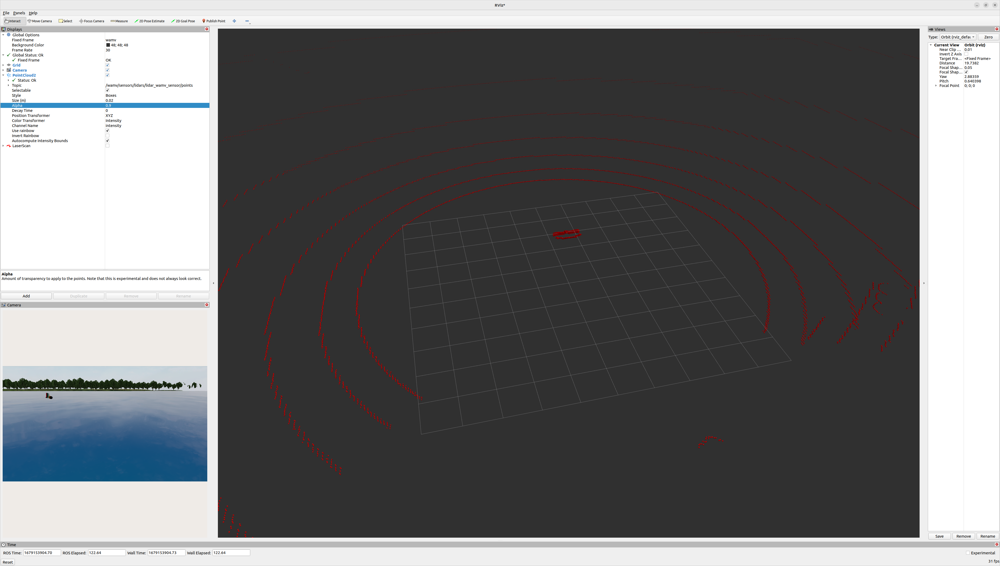

# Docker Image for Virtual RobotX

## How to use

```bash
docker run wamvtan/vrx
```

In default setting, you can publish/subscribe these topics.  

```bash
/clock
/parameter_events
/rosout
/tf
/tf_static
/vrx/contacts
/vrx/task/info
/wamv/pingers/pinger/range_bearing
/wamv/pingers/pinger/set_pinger_position
/wamv/pose
/wamv/pose_static
/wamv/sensors/cameras/front_left_camera_sensor/camera_info
/wamv/sensors/cameras/front_left_camera_sensor/image_raw
/wamv/sensors/cameras/front_left_camera_sensor/optical/camera_info
/wamv/sensors/cameras/front_left_camera_sensor/optical/image_raw
/wamv/sensors/cameras/front_right_camera_sensor/camera_info
/wamv/sensors/cameras/front_right_camera_sensor/image_raw
/wamv/sensors/cameras/front_right_camera_sensor/optical/camera_info
/wamv/sensors/cameras/front_right_camera_sensor/optical/image_raw
/wamv/sensors/cameras/middle_right_camera_sensor/camera_info
/wamv/sensors/cameras/middle_right_camera_sensor/image_raw
/wamv/sensors/cameras/middle_right_camera_sensor/optical/camera_info
/wamv/sensors/cameras/middle_right_camera_sensor/optical/image_raw
/wamv/sensors/gps/gps/fix
/wamv/sensors/imu/imu/data
/wamv/sensors/lidars/lidar_wamv_sensor/points
/wamv/sensors/lidars/lidar_wamv_sensor/scan
/wamv/thrusters/left/pos
/wamv/thrusters/left/thrust
/wamv/thrusters/right/pos
/wamv/thrusters/right/thrust
```

Using rviz, you can check lidar / camera data comes from docker container.　　


