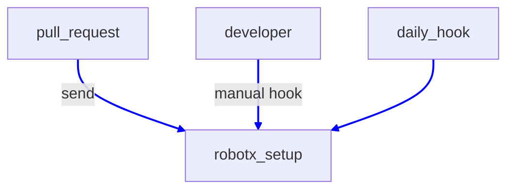
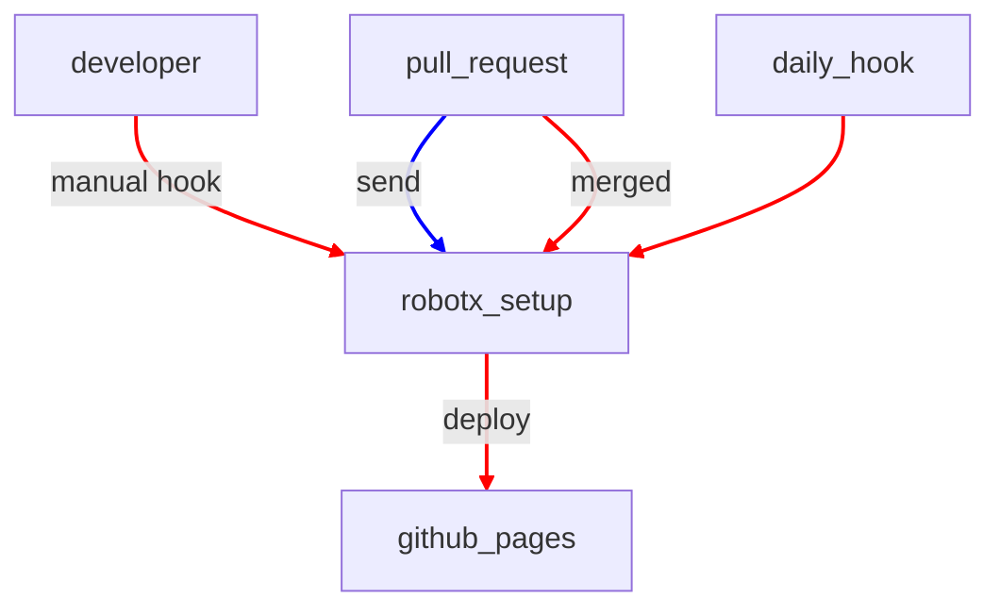
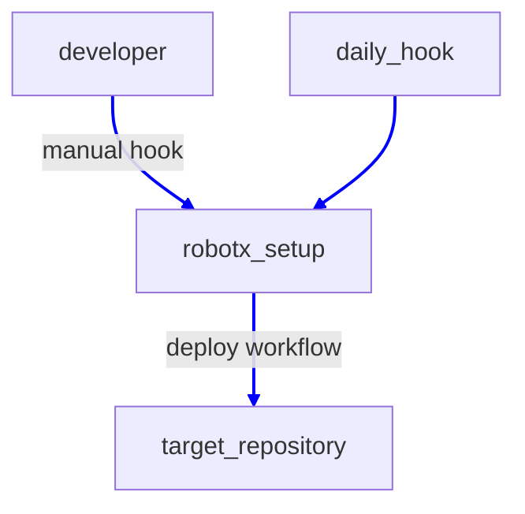
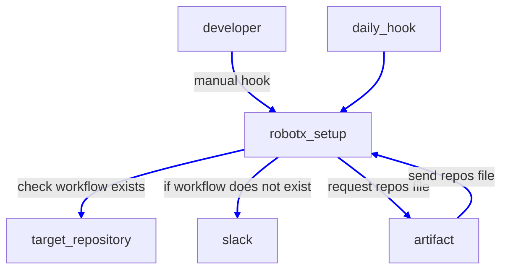

# Automation Pipeline

## Repository Architecture
OUXT-Polaris softwares are separeated in many repositories in order to run continuous integration quickly.  
So, we developing integration pipeline for operating complex software stacks and deploy it.

## Integration Pipeline

Integration pipeline is deployed at github actions in each repositories.

### Actions in robotx_setup package

You can see acions tatus [here](https://github.com/OUXT-Polaris/robotx_setup/actions).

#### robotx_setup

robotx_setup job runs ansible with setup-full playbook and check the setup tool works well. 

build_docker job runs ansible with setup-docker playbook and check the setup tool works well with docker.

#### document

documentation workflow generate this documentation site and deploy it into github pages.

#### deploy_workflow

deploy_workflow helps maintainers to deploy and maintain workflows for each pacakges.
currently, over 25 packages are maintained by this workflow.

#### check_workflow_deployment

check_workflow_deployment workflow checks github repositories in downloaded repos file and if the requred workflow does not exist in the target repository, notify this infomation to the team slack.

### Actions in each repositories

In each repository, pull requests automatically runs build tests, unit tests and scenario test.