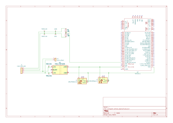

# Computer Sensor Board

This board provides power to the Mini-V control system.  

!!! Warning
    This board is designed assuming that a DC/DC converter or similar device is installed externally and 12V power is input.  Do not apply any other voltage.  

## Development Status

Under development.

## Schematic

!!! Note
    The sensor's data sheet (https://www.amtechs.co.jp/product/VLP-16-Puck.pdf) shows that it allows input voltages from 9V~32V.
    However, if you check the Interface Box schematic (https://docs.clearpathrobotics.com/assets/files/clearpath_robotics_023729-TDS2-2c7454cf9f317be53ce1938dca7ddcf 4.pdf, page 112), it is assumed that 12V is expected to be input to VLP16.
    Therefore, a system to convert 18V => 12V is provided.

## Board Design

### Front

### Back

