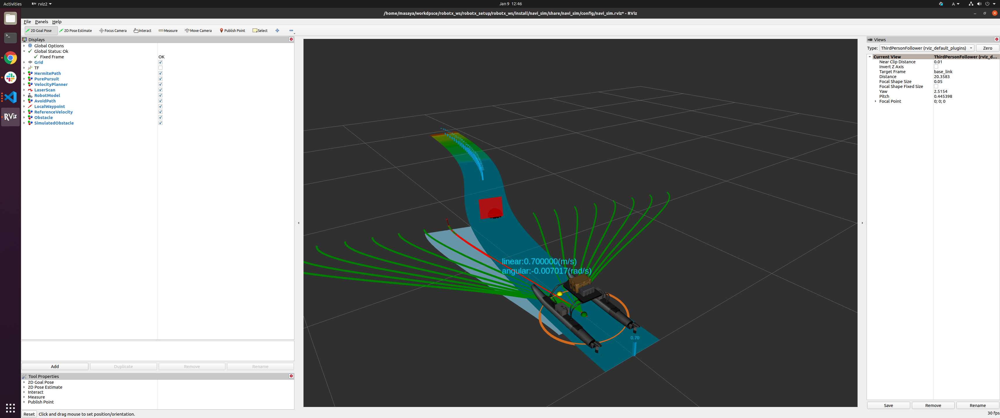

# Navigation Demo

[](https://www.youtube.com/watch?v=nkrm7e8vdPg)

## How to run demo
### build packages
Please see also, [this page](build_instraction.md).

### run simulator and planner

```
ros2 launch navi_sim with_planner.launch.py behavior_config_filepath:=config/loop_demo.yaml
```

### set goal
use 2d goal pose tool in rviz.  


then, the navigation starts.  


### spawn obstacle
use clicked point tool in rviz


then, replan waypoints.  
